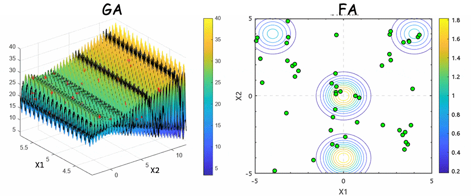

# Intelligent-Optimization-Labs

**Intelligent-Optimization-Labs** 是一个基于 MATLAB 实现的智能优化算法实验项目，包含遗传算法（Genetic Algorithm, GA）和萤火虫算法（Firefly Algorithm, FA）的实现及其可视化功能。

## 简介

该项目包含两种经典的智能优化算法：遗传算法和萤火虫算法的实现和可视化。

## 算法介绍

### 遗传算法（GA）

遗传算法是一种模拟自然进化过程的全局优化算法。它通过选择、交叉和变异等操作迭代生成下一代种群，逐步逼近最优解。

- 初始化种群：通过设定种群大小和变量范围，随机生成初始种群。
- 选择算子：使用轮盘赌或锦标赛选择等方法筛选适应度较高的个体。
- 交叉算子：对选中的个体进行交叉操作，生成新个体。
- 变异算子：在一定概率下对个体进行变异，增强种群多样性。
- 可视化：展示种群在搜索空间中的变化，以及每代最优个体的适应度变化。

### 萤火虫算法（FA）

萤火虫算法是一种基于生物萤火虫发光特性设计的优化算法。萤火虫个体通过亮度和吸引力相互影响，从而找到全局最优解。

- 初始化：生成随机分布的萤火虫个体。
- 吸引力：较亮的萤火虫吸引较暗的萤火虫，个体通过移动进行解空间探索。
- 光强衰减：根据距离和亮度进行动态调整，防止过早收敛。
- 可视化：实时展示萤火虫群体在解空间中的位置变化，以及最优解的动态更新。